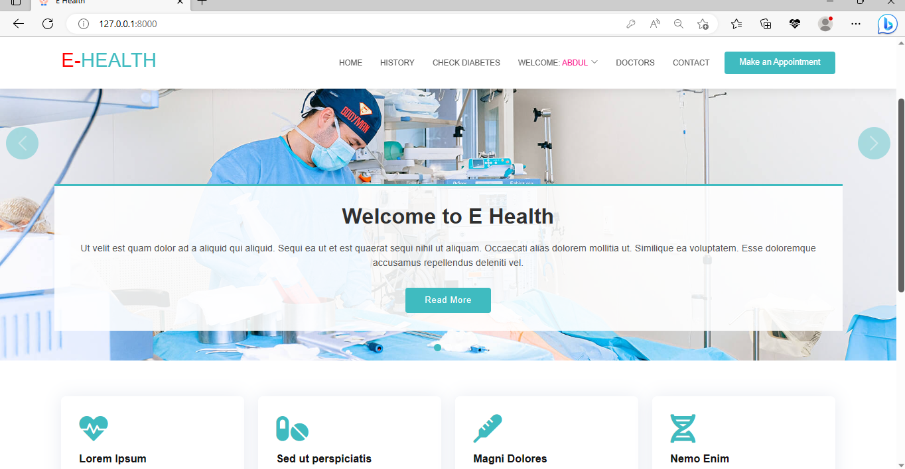
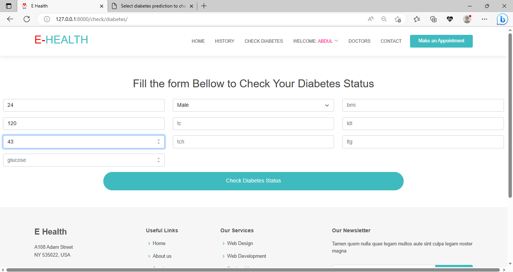
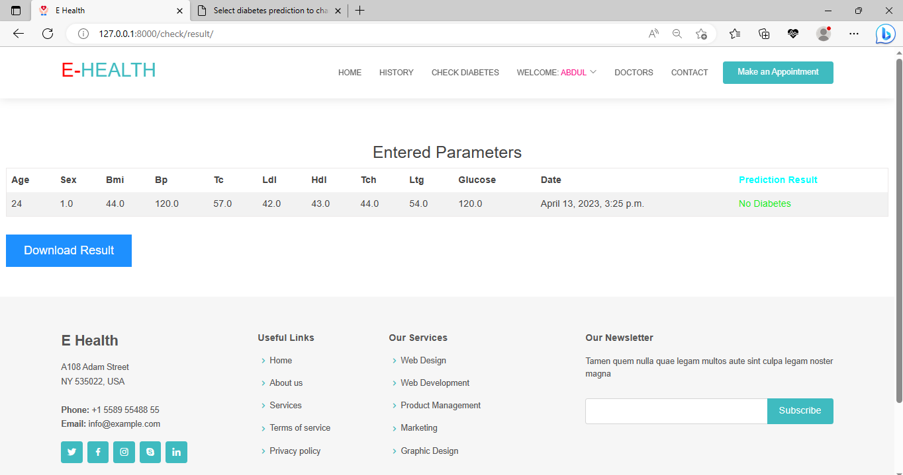

# E-Health

EHealth is an online Medical website where patient can register, predict there Diabetes status, and build a medical history. This project uses diabetes dataset related to people (age, sex, bmi, ldl etc..) who have been given a value that corresponds to a certain progression of diabetes. A machine learning model was developed with a test set for evaluating model (30% testing & 70% training) and then use to build this app. for every user inputs of (age, sex, bmi, ldl etc…) a prediction of a certain progression of diabetes can be made before having clinical trials.

  Built with Django, Pandas, scikit-learn Bootstrap and Javascript.






### App Features

-   Machine learning prediction model for diabetes.
-   Multiple custom user type Doctor/Patient.
-   Patient can register, predict there Diabetes status, and build a medical history
-   Admin can view Patient information and medical history.
-   Patient can view, download results of diabetes & medical history recorded in PDF format.


### How to Set up the application
Open terminal and use git clone command to download the remote Github repository to your computer
```bash
  1. git clone 
  2. cd e_health
  3. python3 -m venv venv
  4. venv/bin/activate
  5. pip3 install -r requirements.txt
  6. Generate a new secret key or use default
  7. python manage.py makemigrations
  8. python manage.py migrate
  9. python manage.py createsuperuser
  10. python manage.py runserver
  11. visit live server at http://127.0.0.1:8000/